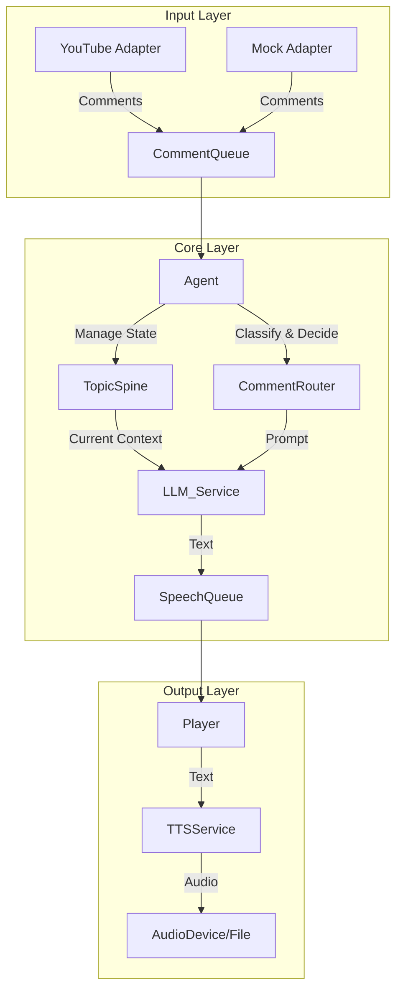

# アーキテクチャ (Architecture)

## 1. モジュール構成
システムは大きく「入力(Input)」「核(Core)」「出力(Output)」の3層に分かれる。



## 2. コンポーネント詳細

### 2.1 Input Layer
- **IChatAdapter**: チャット取得の共通インターフェース。
    - `YouTubeLiveAdapter`: `liveChatMessages.list` をポーリング。`nextPageToken` と `pollingIntervalMillis` を管理。
    - `FileReplayAdapter`: テスト用。JSONファイルから一定間隔でコメントを流す。

### 2.2 Core Layer
- **Agent**: 全体のオーケストレーター。ループ処理を行い、TopicSpineの状態監視とコメント処理の優先順位付けを行う。
- **TopicSpine**: 会話の骨格を管理するステートマシン。
    - 現在の `Topic` と `Outline` を保持。
    - 進行度 (`currentSectionIndex`) を管理。
- **CommentRouter**: 受信したコメントの分類器。
    - LLMへの問い合わせ、または単純なキーワードマッチングで分類。
- **LLMService**: LLM (OpenAI/Anthropic/Gemini) とのゲートウェイ。
    - プロンプトテンプレート管理。

### 2.3 Output Layer
- **SpeechQueue**: 発話タスクのFIFOキュー。
    - 優先度付き: 「割り込み返答」 > 「本線トーク」
- **ITTSService**: 音声合成の共通インターフェース。
    - `VoicevoxService`: ローカルまたはリモートのVOICEVOX Engineを利用。
    - `ConsoleLogService`: 音声を生成せず、テキストログのみ出力（デバッグ用）。
- **Player**: 音声再生管理。
    - 前の再生が終わるまで待機し、重複再生（被り）を防ぐ。

## 3. データフロー
1. **Tick (Loop)**: Agentが定期実行 (e.g., 100ms)
2. **Fetch**: Adapterから新着コメントを取得 -> `IncomingQueue`
3. **Process**:
    - `IncomingQueue` にコメントがある場合:
        - `CommentRouter` で分類。
        - ON_TOPICなら即時LLM生成 -> `SpeechQueue` (Priority: High)
    - `IncomingQueue` が空 かつ `SpeechQueue` も空の場合:
        - `TopicSpine` をチェック。
        - “間”が十分空いていれば、次の `Outline` のトークをLLM生成 -> `SpeechQueue` (Priority: Normal)
4. **Speak**:
    - `Player` が `SpeechQueue` から取り出し、`TTSService` で音声化して再生。

## 4. 状態管理と永続化
- **In-Memory State**: `TopicSpine`, `Queues` はメモリ上に保持。
- **Logging**:
    - 実行ログ: `logs/app.log` (Winston/Pino)
    - イベントログ: `logs/events.ndjson` (JSON lines)

## 5. 差し替えポイント (Dependency Injection)
- `IChatAdapter`: 本番(YouTube) / テスト(Mock)
- `ITTSService`: 本番(Voicevox) / 開発(Console)
- `ILLMClient`: モデルの切り替え

## 6. ディレクトリ構造案
```
src/
  ├── adapters/       # YouTube, Mock, Voicevox
  ├── core/           # Agent, TopicSpine, CommentRouter
  ├── interfaces/     # Shared Types (IChatAdapter, etc.)
  ├── services/       # LLM wrapper
  ├── utils/          # Logger, Helper
  ├── config/         # Environment variables
  └── index.ts        # Entry point
```
