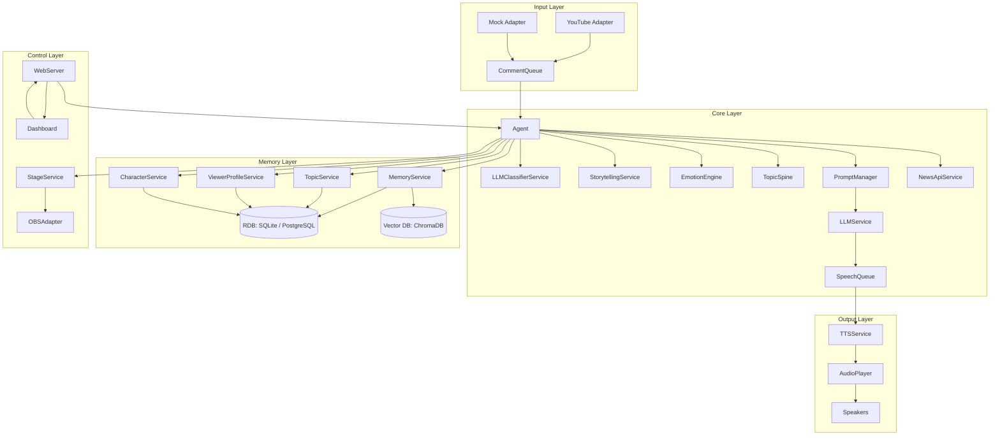

# アーキテクチャ (Architecture)

## 1. モジュール構成
システムは「入力(Input)」「コア(Core)」「記憶(Memory)」「出力(Output)」「制御(Control)」の5層で構成される。


```mermaid
graph TD
    subgraph Input Layer
        YouTubeAdapter[YouTube Adapter] --> CommentQueue
        MockAdapter[Mock Adapter] --> CommentQueue
    end

    subgraph Core Layer
        CommentQueue --> Agent
        Agent --> LLMClassifierService
        Agent --> StorytellingService
        Agent --> EmotionEngine
        Agent --> TopicSpine
        Agent --> PromptManager
        PromptManager --> LLMService
        LLMService --> SpeechQueue
        Agent --> NewsApiService
    end

    subgraph Memory Layer
        Agent --> MemoryService
        Agent --> TopicService
        Agent --> ViewerProfileService
        Agent --> CharacterService
        MemoryService --> Prisma[(RDB: SQLite / PostgreSQL)]
        TopicService --> Prisma
        ViewerProfileService --> Prisma
        CharacterService --> Prisma
        MemoryService --> Chroma[(Vector DB: ChromaDB)]
    end

    subgraph Output Layer
        SpeechQueue --> TTSService
        TTSService --> AudioPlayer
        AudioPlayer --> Speakers
    end

    subgraph Control Layer
        WebServer --> Dashboard
        Dashboard --> WebServer
        WebServer --> Agent
        Agent --> StageService
        StageService --> OBSAdapter
    end
```

## 2. コアコンポーネント詳細

### 2.1 Input Layer
- **IChatAdapter**: チャット取得の共通インターフェース。
  - `YouTubeLiveAdapter`: YouTube Live Chat APIをポーリング。
  - `FileReplayAdapter`: JSONリプレイでテスト。

### 2.2 Core Layer
- **Agent**: 全体のオーケストレーター。分類、記憶、プロンプト生成、音声出力を統合。
- **LLMClassifierService**: コメントの意図・感情・トピックを抽出。
- **StorytellingService**: ナラティブ進行、トレンド検出、雰囲気の更新。
- **EmotionEngine**: 感情状態の推定と音声パラメータの調整。
- **TopicSpine**: 配信のセクション進行を管理。
- **PromptManager**: 記憶・視聴者プロフィール・話題履歴・感情/雰囲気を統合したプロンプトを生成。
- **NewsApiService**: `!news` コマンドでニュースを取得。

### 2.3 Memory Layer (RDB-centric)
- **Prisma + RDB**: Stream / Message / Viewer / ViewerProfile / TopicHistory / Memory を永続化。
- **MemoryService**: RDBを主とした記憶管理。必要に応じてChromaDBへベクトル同期。
- **TopicService**: 話題履歴を蓄積し、PromptManagerへ注入。
- **ViewerProfileService**: 視聴者のプロフィール情報を抽出・更新。

### 2.4 Output Layer
- **SpeechQueue**: 発話タスクの優先度付きキュー。
- **ITTSService**: VOICEVOXやモックTTSを切り替え。
- **AudioPlayer**: 再生待ち管理・音声再生。

### 2.5 Control Layer
- **WebServer + Dashboard**: Socket.IOで双方向操作。
  - 感情の強制切り替え
  - 独り言の強制トリガー
  - NGワード設定 / ミュート
- **StageService + OBSAdapter**: シーン切り替えやソース制御をサポート。

## 3. データフロー
1. **Fetch**: Adapterが新着コメントを取得 → `CommentQueue`
2. **Classify**: LLMClassifierServiceが意図/感情/トピックを判定
3. **Enrich**: 記憶検索・話題履歴・視聴者プロフィールを取得
4. **Prompt**: PromptManagerが動的プロンプトを構築
5. **Generate**: LLMが返答 or モノローグを生成
6. **Speak**: TTS → AudioPlayer → Output

## 4. 状態管理と永続化
- **RDB (Prisma)**: 配信セッション、視聴者、メッセージ、話題履歴、記憶の中心ストア
- **Vector DB (ChromaDB)**: 長期記憶の類似検索（任意）

## 5. 差し替えポイント (Dependency Injection)
- `IChatAdapter`: YouTube / Mock
- `ITTSService`: Voicevox / Mock
- `ILLMService`: OpenAI / Groq / xAI
- `MemoryService`: 実装差し替え可能（Prisma-only / Vector連携）

## 6. ディレクトリ構造
```
src/
  ├── adapters/       # YouTube, Mock, OBS, VTS
  ├── core/           # Agent, TopicSpine, PromptManager, EmotionEngine
  ├── interfaces/     # Shared Types
  ├── services/       # LLM, Memory, Profile, News, Storytelling
  ├── server/         # WebServer (Dashboard)
  ├── config/         # Environment variables
  └── index.ts        # Entry point
```
