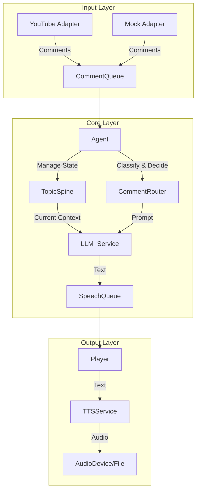

# Day 1 Implementation Prompt (for Kamee 4D / Codex)

あなたはTypeScriptのエキスパートエンジニアです。
既に作成された設計ドキュメント(`docs/*.md`)に基づき、**Day 1: チャット取得 (Input) のタスク**を並列実行で一気に実装してください。

## 実行タスク: Day 1 (Input Layer)

以下のファイル群を生成・実装してください。各ファイルは単独で動作するように依存関係を解決してください。

### 1. プロジェクト基盤 (Project Setup)
- **`package.json`**:
  - `typescript`, `ts-node`, `dotenv`, `googleapis` (YouTube用), `axios` (汎用) を依存に追加。
  - `start`, `dev` スクリプトを定義。
- **`tsconfig.json`**:
  - Node.js 22, ESNext, Strict mode enabled.
  - `src` を rootDir, `dist` を outDir。
- **`.env.example`**:
  - `YOUTUBE_API_KEY`, `YOUTUBE_VIDEO_ID` などの変数例。
- **`.gitignore`**:
  - `node_modules`, `.env`, `dist`, `logs` を除外。

### 2. インターフェース定義 (Interfaces)
- **`src/interfaces/index.ts`**:
  - `docs/interfaces.md` に定義された `IChatAdapter`, `ChatMessage` などの型を実装コードとして出力。

### 3. アダプター実装 (Adapters)
- **`src/adapters/FileReplayAdapter.ts`**:
  - 指定されたJSONファイルパスから配列を読み込み、`pollingInterval` (例: 1000ms) ごとに順番にメッセージを返すモック。
  - `fetchNewMessages()` で「前回取得時以降」のデータを返すロジック。
- **`src/adapters/YouTubeLiveAdapter.ts`**:
  - `googleapis` または `fetch` を使用。
  - `liveChatId` がなければ `liveBroadcasts.list` から取得するロジックを含む(あるいはconfigでID直指定も可)。
  - `liveChatMessages.list` をポーリングし、重複排除して返す。
  - クオータ制限を考慮し、APIが返す `pollingIntervalMillis` を遵守するsleepを入れること。

### 4. エントリーポイント (Entry Point)
- **`src/index.ts`**:
  - 環境変数で使用するAdapter (`MOCK` or `YOUTUBE`) を切り替え。
  - Adapterをインスタンス化し、メインループで `fetchNewMessages()` を呼び出し続ける。
  - 取得したメッセージを `console.log` で見やすく出力する (Day 1ゴール)。

## 制約事項
- エラーハンドリング: API呼び出し失敗時もプロセスを落とさず、エラーログを出してリトライ待機すること。
- 非同期処理: `async/await` を適切に使用。
- コード品質: 型定義をしっかり行い、`any` は極力避ける。

## 出力指示
上記の各ファイル (`package.json`, `tsconfig.json`, `src/...`) の完全な実装コードを出力してください。

## コンテキスト
以下の内容を前提としてください。
- `docs/spec.md`: 仕様全体
# 仕様書 (Specification)

## 1. 概要
YouTube Liveのコメントをリアルタイムに拾いつつ、コメントがない間は事前に設定された「雑談テーマ」に沿って能動的に会話を続けるAI配信エージェントのMVP。

## 2. ユースケース

### UC-01: 能動的な雑談（Base Loop）
- エージェントは設定された `TopicSpine` (話題の骨子) に従い、小見出し順にトークを展開する。
- 1つの小見出しについて話した後、一定の「間（Silence）」を置き、コメントがなければ次の小見出しへ進む。
- 全ての小見出しを消化したら、終了するか、次のテーマへ移行する。

### UC-02: コメントへの反応（Interruption）
- 視聴者からのコメントを受信した場合、即座に分類を行う。
- **ON_TOPIC (関連)**: 現在の話題に関連する質問や感想。短く回答し、現在の小見出しのトークへ戻る。
- **REACTION (反応)**: 「草」「かわいい」などの単発反応。挨拶や相槌のみ返し、即座に本線へ戻る。
- **OFF_TOPIC (脱線)**: 現在の話題と無関係な話。「後でその話をしましょう」と返すか、無視（キューに積む）して本線を維持する。
- **TOPIC_CHANGE (話題変更)**: 明示的な話題変更要求。現在の話題ロック(`topicLockUntil`)が解除されていれば検討、そうでなければ却下。

### UC-03: 配信管理
- 起動時にYouTube Live IDまたはリプレイ用JSONを指定して開始。
- Ctrl+C 等のシグナルで安全に停止（ログ保存）。

## 3. 非機能要件
- **レイテンシ**: コメント取得から発話までのラグを極力短く（MVP目標: 5-10秒程度）。
- **安定性**: YouTube APIのクォータ制限超過やネットワークエラー時もプロセスを落とさず、待機・リトライを行う。
- **拡張性**: 音声バックエンド(VOICEVOX)や入力ソース(YouTube)をインターフェースで分離し、差し替え可能にする。

## 4. 会話ポリシー (Conversation Policy)

### 状態管理: TopicSpine
エージェントは常に以下の状態を持つ。
- `topic`: 現在の大テーマ (例: "最近買ったガジェット")
- `outline`: 話す項目のリスト (例: ["導入", "キーボードの良さ", "マウスの悩み", "まとめ"])
- `currentSection`: 現在話している項目インデックス
- `topicLockUntil`: テーマ変更を禁止する時刻 (UNIX timestamp)

### コメント処理フロー
1. **受信**: 定期ポーリングで取得。
2. **分類**: LLM (または簡易ルール) で `ON_TOPIC` / `REACTION` / `OFF_TOPIC` / `CHANGE_REQ` に分類。
3. **決定**:
   - `ON_TOPIC`/`REACTION` -> 優先度高キューに「返答」を積む。
   - `OFF_TOPIC` -> `PendingQueue` に積む (今は話さない)。
   - `CHANGE_REQ` -> ロック期間外なら `TopicSpine` 更新を検討。

## 5. 失敗時の挙動
- **APIエラー**: 指数バックオフでリトライ。
- **音声合成エラー**: ダミー音声またはログ出力のみでスキップし、進行を止めない。
- **LLMエラー**: 定型文（「ちょっと考え中…」等）を出力してリトライ。

## 6. データ永続化 (DB方針)
MVPでは **DBなし (In-Memory)** を基本とする。
ただし、将来的な拡張のため、全てのイベントは **NDJSON形式のログファイル** に記録する。

### 最小構成DB設計 (Optional)
もしSQLiteを導入する場合のスキーマ:
- `runs`: 配信単位のメタデータ
- `events`: 時系列イベントログ (type: `chat`, `speak`, `action`)

- `docs/architecture.md`: ディレクトリ構造とモジュール構成
# アーキテクチャ (Architecture)

## 1. モジュール構成
システムは大きく「入力(Input)」「核(Core)」「出力(Output)」の3層に分かれる。



## 2. コンポーネント詳細

### 2.1 Input Layer
- **IChatAdapter**: チャット取得の共通インターフェース。
    - `YouTubeLiveAdapter`: `liveChatMessages.list` をポーリング。`nextPageToken` と `pollingIntervalMillis` を管理。
    - `FileReplayAdapter`: テスト用。JSONファイルから一定間隔でコメントを流す。

### 2.2 Core Layer
- **Agent**: 全体のオーケストレーター。ループ処理を行い、TopicSpineの状態監視とコメント処理の優先順位付けを行う。
- **TopicSpine**: 会話の骨格を管理するステートマシン。
    - 現在の `Topic` と `Outline` を保持。
    - 進行度 (`currentSectionIndex`) を管理。
- **CommentRouter**: 受信したコメントの分類器。
    - LLMへの問い合わせ、または単純なキーワードマッチングで分類。
- **LLMService**: LLM (OpenAI/Anthropic/Gemini) とのゲートウェイ。
    - プロンプトテンプレート管理。

### 2.3 Output Layer
- **SpeechQueue**: 発話タスクのFIFOキュー。
    - 優先度付き: 「割り込み返答」 > 「本線トーク」
- **ITTSService**: 音声合成の共通インターフェース。
    - `VoicevoxService`: ローカルまたはリモートのVOICEVOX Engineを利用。
    - `ConsoleLogService`: 音声を生成せず、テキストログのみ出力（デバッグ用）。
- **Player**: 音声再生管理。
    - 前の再生が終わるまで待機し、重複再生（被り）を防ぐ。

## 3. データフロー
1. **Tick (Loop)**: Agentが定期実行 (e.g., 100ms)
2. **Fetch**: Adapterから新着コメントを取得 -> `IncomingQueue`
3. **Process**:
    - `IncomingQueue` にコメントがある場合:
        - `CommentRouter` で分類。
        - ON_TOPICなら即時LLM生成 -> `SpeechQueue` (Priority: High)
    - `IncomingQueue` が空 かつ `SpeechQueue` も空の場合:
        - `TopicSpine` をチェック。
        - “間”が十分空いていれば、次の `Outline` のトークをLLM生成 -> `SpeechQueue` (Priority: Normal)
4. **Speak**:
    - `Player` が `SpeechQueue` から取り出し、`TTSService` で音声化して再生。

## 4. 状態管理と永続化
- **In-Memory State**: `TopicSpine`, `Queues` はメモリ上に保持。
- **Logging**:
    - 実行ログ: `logs/app.log` (Winston/Pino)
    - イベントログ: `logs/events.ndjson` (JSON lines)

## 5. 差し替えポイント (Dependency Injection)
- `IChatAdapter`: 本番(YouTube) / テスト(Mock)
- `ITTSService`: 本番(Voicevox) / 開発(Console)
- `ILLMClient`: モデルの切り替え

## 6. ディレクトリ構造案
```
src/
  ├── adapters/       # YouTube, Mock, Voicevox
  ├── core/           # Agent, TopicSpine, CommentRouter
  ├── interfaces/     # Shared Types (IChatAdapter, etc.)
  ├── services/       # LLM wrapper
  ├── utils/          # Logger, Helper
  ├── config/         # Environment variables
  └── index.ts        # Entry point
```

- `docs/tasks.md`: Day 1の具体的なToDo
# タスク分解 (Tasks: 1-Week MVP)

## Day 1: チャット取得 (Input)
- [ ] **プロジェクトセットアップ**
  - Node.js + TypeScript 初期化 (`npm init`, `tsconfig.json`)
  - ESLint/Prettier 設定
  - `.env` 管理導入
- [ ] **インターフェース定義**
  - `IChatAdapter`, `IChatMessage` 定義
- [ ] **Mock実装**
  - `FileReplayAdapter`: JSONファイルから読み込んで標準出力する
- [ ] **YouTube API実装**
  - Google Cloud Console プロジェクト作成 & API有効化
  - `YouTubeLiveAdapter`: `liveChatMessages.list` ポーリング実装
  - 認証キー(API Key)での動作確認
- **完了条件**: YouTube Liveのコメントがコンソールにリアルタイム表示されること。

## Day 2: 会話エンジン (Core Logic)
- [ ] **TopicSpine実装**
  - クラス設計: `topic`, `outline`, `currentSection`
  - 状態遷移ロジック: `next()`
- [ ] **CommentRouter実装 (ルールベース仮)**
  - 正規表現などで簡易判定 (e.g. "?"があれば質問)
- [ ] **Agentループ実装**
  - メインループ構築
  - コメント有無による分岐処理
- **完了条件**: コメントがない時は順番にログが出る、コメントが来たら「反応」ログが出る。

## Day 3: LLM接続 (Intelligence)
- [ ] **LLMサービス実装**
  - OpenAI API (または他) クライアント実装
  - プロンプト管理クラス
- [ ] **プロンプト作成**
  - `prompts/monologue.md` (独り言/雑談用)
  - `prompts/reply.md` (返信/割り込み用)
- [ ] **つなぎこみ**
  - `TopicSpine` の内容をプロンプトに埋め込んで生成
  - 生成テキストを `SpeechQueue` に積む
- **完了条件**: 実際に意味の通る雑談と返答テキストが生成されること。

## Day 4: 音声合成 (Output)
- [ ] **ITTSServiceインターフェース定義**
- [ ] **VOICEVOX連携**
  - ローカルのVOICEVOX Engineを叩く `VoicevoxService` 実装
  - `/audio_query` -> `/synthesis` フロー
- [ ] **Player実装**
  - wavデータの再生 (Speaker/Node-speaker等)
  - 再生完了待ち合わせ (排他制御)
- **完了条件**: 生成されたテキストがVOICEVOXの声で再生され、被らずに順番に流れること。

## Day 5: 統合テスト (Integration)
- [ ] **リプレイテスト環境**
  - 過去の配信コメントJSONを用意
  - `FileReplayAdapter` + ダミー音声(ログ) で高速回し
- [ ] **シナリオテスト**
  - コメント過多時の挙動確認
  - 過疎時の雑談継続確認
- [ ] **エラーハンドリング強化**
  - ネットワーク切断時の再接続
  - API制限時のWait

## Day 6-7: バッファ & 品質向上 (Polish)
- [ ] **「間」の調整**
  - 機械的な連続発話を防ぐランダムWait
- [ ] **OFF_TOPICの回収**
  - 話題切れ時にPendingQueueから拾うロジック
- [ ] **SQLite導入 (Optional)**
  - イベントログ保存の実装

## 完了の定義 (Definition of Done)
1. `npm start` で起動し、放置しておくと勝手に雑談を続ける。
2. YouTubeでコメントすると、適切なタイミングで反応して戻る。
3. 1時間稼働させても落ちない。

- `docs/interfaces.md`: 型定義
# インターフェース定義 (Interfaces)

## 1. Chat Adapter

```typescript
export interface ChatMessage {
  id: string;
  authorName: string;
  content: string;
  timestamp: number;
}

export interface IChatAdapter {
  /**
   * 初期化処理 (API接続など)
   */
  connect(config: any): Promise<void>;

  /**
   * 新着メッセージを取得する
   * 前回取得以降の差分を返す
   */
  fetchNewMessages(): Promise<ChatMessage[]>;

  /**
   * 切断/終了処理
   */
  disconnect(): void;
}
```

## 2. TTS Service (Output)

```typescript
export interface TTSService {
  /**
   * テキストから音声データを生成する
   * @param text 話す内容
   * @param options 声質などのオプション
   * @returns 音声バイナリデータ (wav/mp3)
   */
  synthesize(text: string, options?: any): Promise<Buffer>;

  /**
   * サービスの生存確認
   */
  isReady(): Promise<boolean>;
}
```

## 3. LLM Service

```typescript
export interface LLMRequest {
  systemPrompt: string;
  userPrompt: string;
  temperature?: number;
}

export interface ILLMService {
  /**
   * テキスト生成を実行する
   */
  generateText(req: LLMRequest): Promise<string>;
}
```

## 4. Conversation Types

```typescript
export enum CommentType {
  ON_TOPIC = 'ON_TOPIC',
  REACTION = 'REACTION',
  OFF_TOPIC = 'OFF_TOPIC',
  CHANGE_REQ = 'TOPIC_CHANGE_REQUEST',
  IGNORE = 'IGNORE' // スパムなど
}

export interface TopicState {
  currentTopicId: string;
  title: string;
  outline: string[]; // 小見出しリスト
  currentSectionIndex: number; // 現在の小見出し
  lockUntil: number; // UNIX timestamp
}

export interface SpeechTask {
  id: string;
  text: string;
  priority: 'HIGH' | 'NORMAL' | 'LOW'; // 割り込みはHIGH
  sourceCommentId?: string; // 返信の場合
  timestamp: number;
}
```

